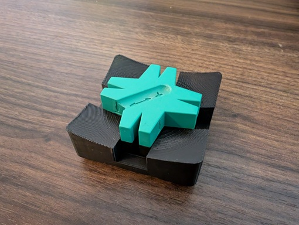

# OpenSCAD models

This repository contains OpenSCAD models created by me.

## Models

This section provides a list of the models available in the `models` directory of this repository.

### Gridfinity module for the Wera Star magnetizer

This is a Gridfinity 1.5x1.5 module for holding the Wera Star magnetizer.

- OpenSCAD file: [wera_star_holder.scad](models/gridfinity/wera_star_holder.scad)
- Makerworld (STL and 3MF): https://makerworld.com/en/models/953733

## Libraries

Most models make use of the _BOSL2_ library.
Gridfinity models make use of the _gridfinity_extended_openscad_ library.
Make sure those are installed in your OpenSCAD libraries folder:

- [BOSL2](https://github.com/BelfrySCAD/BOSL2)
- [Gridfinity Extended](https://github.com/ostat/gridfinity_extended_openscad)

See the [Installation](https://github.com/BelfrySCAD/BOSL2?tab=readme-ov-file#installation) section of the _BOSL2_ README for instructions on installing libraries.

## License

All files in this repository are licensed under the [Creative Commons 4.0 BY-NC-SA](https://creativecommons.org/licenses/by-nc-sa/4.0/) license, unless stated otherwise.
See [LICENSE.md](./LICENSE.md).
