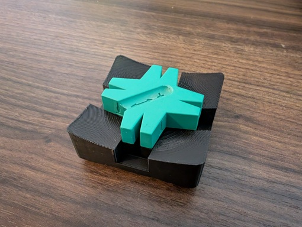

# OpenSCAD models

This repository contains OpenSCAD models created by me.

## Models

This section provides a list of notable models available in the `models` directory of this repository.

### Gridfinity module for the Wera Star magnetizer

This is a Gridfinity 1.5x1.5 module for holding the Wera Star magnetizer.

- OpenSCAD file: [wera_star_holder.scad](models/gridfinity/wera_star_holder.scad)
- Makerworld (STL and 3MF): https://makerworld.com/en/models/953733

### Gridfinity modules from Wera and Facom screwdrivers

These are 3x1 Gridfinity modules for holding Wera and Facom (old style) screwdrivers
designed to be used with the [Gridfinity Universal Wera Screwdriver Inserts by Scubafan](https://makerworld.com/en/models/475390#profileId-393764).

- OpenSCAD files:
    - For 82mm Wera handles: [screwdriver_holder_wera_82mm.scad](models/gridfinity/screwdriver_holder_wera_82mm.scad)
    - For the 72.5mm Wera mains tester: [screwdriver_holder_wera_72.5mm_mains_tester.scad](models/gridfinity/screwdriver_holder_wera_72.5mm_mains_tester.scad)
    - For 120mm Facom handles: [screwdriver_holder_facom_120mm.scad](models/gridfinity/screwdriver_holder_facom_120mm.scad)
    - For 110mm Facom handles: [screwdriver_holder_facom_110mm.scad](models/gridfinity/screwdriver_holder_facom_110mm.scad)
    - For 105mm Facom handles: [screwdriver_holder_facom_105mm.scad](models/gridfinity/screwdriver_holder_facom_105mm.scad)
    - For 96mm Facom handles: [screwdriver_holder_facom_96mm.scad](models/gridfinity/screwdriver_holder_facom_96mm.scad)
- Makerworld (STL and 3MF):
    - For Wera screwdrivers: For https://makerworld.com/en/models/955947

Note: The OpenSCAD files for Facom handles require extra STL files available from TraceParts. See [assets/facom/README.md](assets/facom/README.md).

## Libraries

Most models make use of the _BOSL2_ library.
Gridfinity models make use of the _gridfinity_extended_openscad_ library.
Make sure those are installed in your OpenSCAD libraries folder:

- [BOSL2](https://github.com/BelfrySCAD/BOSL2)
- [Gridfinity Extended](https://github.com/ostat/gridfinity_extended_openscad)

See the [Installation](https://github.com/BelfrySCAD/BOSL2?tab=readme-ov-file#installation) section of the _BOSL2_ README for instructions on installing libraries.

## License

All files in this repository are licensed under the [Creative Commons 4.0 BY-NC-SA](https://creativecommons.org/licenses/by-nc-sa/4.0/) license, unless stated otherwise.
See [LICENSE.md](./LICENSE.md).
